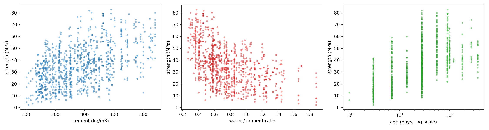
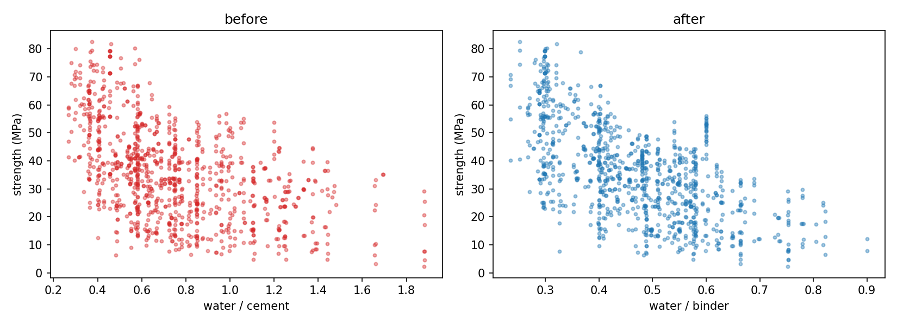
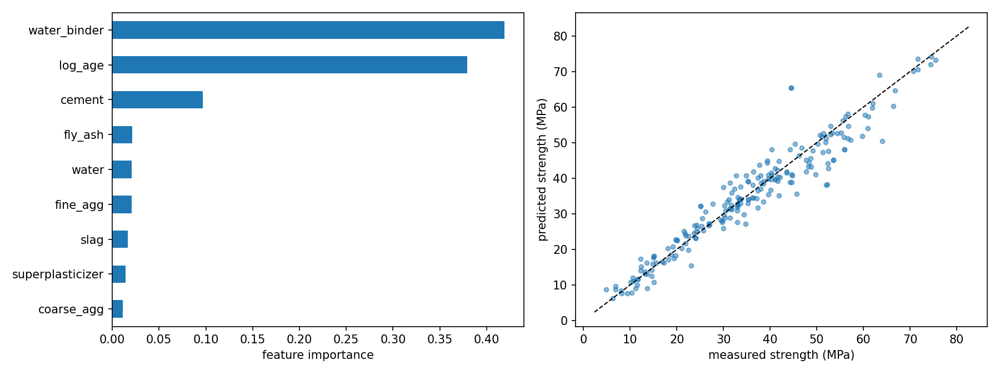

# Predicting concrete compressive strength from mix composition

A regression model that predicts the 28-day compressive strength of concrete from its mix proportions, and a test of whether features derived from concrete theory beat raw ingredient quantities.

Final model: gradient boosting, **4.72 ± 0.38 MPa** cross-validated RMSE.

## Data

1030 concrete mixes from Yeh (1998), via the UCI Machine Learning Repository. Eight inputs: cement, blast furnace slag, fly ash, water, superplasticizer, coarse aggregate and fine aggregate (all kg/m³), plus age in days. The target is compressive strength in MPa.

Measured strength runs from 2.3 to 82.6 MPa with a mean of 35.8, so the set spans early-age samples through to high-performance mixes. Ages are not evenly spread: the median is 28 days and testing happened at about a dozen standard ages, with a thin tail out to 365 days.



Cement content on its own is a loose predictor: at 200 kg/m³ the measured strength ranges from about 5 to 60 MPa. The water/cement ratio is tighter. Age forms vertical stripes because testing happened at standard ages rather than continuously.

## Approach

Rather than feeding the eight raw quantities straight into a model, I added two features that concrete theory says should matter, then measured whether they helped.

**Water-to-binder ratio.** Abrams' law states that strength falls as the water-to-cement ratio rises. Plotting water/cement against strength produced ratios up to 1.9, which is not a real mix. Those points are mixes with low cement but high slag or fly ash content: dividing by cement alone ignores the other binders. Slag and fly ash are cementitious, so they belong in the denominator. Using water / (cement + slag + fly ash) brought the maximum down to 0.90 and tightened the relationship.



**Log of age.** Strength gain against time is roughly logarithmic, which is why 28 days is the standard test age. Plotted on a log axis, the trend straightens out.

Data was split 824 / 206 before any fitting, with a fixed random seed. All reported figures come from the held-out set or from 5-fold cross-validation on the training set.

## Results

| Model | Test RMSE (MPa) | Test R² |
|---|---|---|
| Linear regression, raw features | 9.80 | 0.628 |
| Linear regression, + w/b and log age | 6.57 | 0.832 |
| Random forest | 4.69 | 0.915 |
| Gradient boosting | 4.40 | 0.925 |

Cross-validated (5-fold, training set only):

| Model | CV RMSE (MPa) |
|---|---|
| Random forest | 5.31 ± 0.42 |
| Gradient boosting | 4.72 ± 0.38 |

The two engineered features cut the linear model's error by 33%, from 9.80 to 6.57 MPa, with no change to the model or the data. Moving to tree ensembles cut it by another 2 MPa, which is what you would expect given that strength is nonlinear in the ingredients.

I quote the cross-validated figure as the headline because the single test split landed at the optimistic end of the range.

## What the model used



Gradient boosting feature importances:

| Feature | Importance |
|---|---|
| water_binder | 0.419 |
| age | 0.194 |
| log_age | 0.186 |
| cement | 0.097 |
| fly_ash | 0.021 |
| fine_agg | 0.021 |
| water | 0.021 |
| slag | 0.016 |
| superplasticizer | 0.014 |
| coarse_agg | 0.011 |

Water-to-binder ratio and the two age terms account for 80% of the model's decisions, which matches what concrete theory predicts drives strength.

The more telling comparison is water_binder at 0.419 against raw water at 0.021 and slag at 0.016. Once the ratio was available, the individual ingredient masses became nearly worthless to the model. The ratio captured the mechanism rather than just adding a column.

In the predicted-against-measured plot, points sit evenly about the line through the middle of the range. The strongest mixes, above about 60 MPa, fall slightly below it, so the model under-predicts them. That is the conservative direction, and it happens because high-strength mixes are sparse in the training data.

## Feature engineering only helps a model that needs it

Age appears twice, as raw days and as log days, so I tested whether that duplication mattered:

| Features | CV RMSE (MPa) |
|---|---|
| Both age terms | 4.72 ± 0.38 |
| log_age only | 4.71 ± 0.40 |
| Raw age only | 4.73 ± 0.39 |

No difference. Trees split on thresholds, and the log transform is monotonic, so it reorders nothing: a split at `age > 28` and a split at `log_age > 3.33` separate the same rows.

This is the opposite of what the transform did for the linear model, where it was part of a 33% error reduction. Feature engineering pays off in proportion to how restrictive the model is. A linear model can only add up weighted inputs, so it needs the right inputs; a tree ensemble can find the curvature itself.

Raw age was dropped from the final model. Same accuracy, one fewer column, and the remaining term is the one justified by theory.

## Where the model fails

The worst prediction in the test set over-predicted by 20.8 MPa:

| | |
|---|---|
| Cement | 313 kg/m³ |
| Slag | 145 kg/m³ |
| Water | 127 kg/m³ |
| Superplasticizer | 8 kg/m³ |
| Water / binder | 0.28 |
| Age | 28 days |
| **Measured** | **44.5 MPa** |
| **Predicted** | **65.3 MPa** |

The water-to-binder ratio of 0.28 is near the lowest in the dataset. The model applied the trend it had learned, that lower ratio means higher strength, and predicted 65 MPa.

Abrams' law stops holding at the bottom of the range. Below roughly 0.35 to 0.40 there is not enough water present to hydrate all the binder, so some of it never reacts and strength stops improving as the ratio falls. The slag content compounds it: at 145 kg it is about a third of the binder, and slag reacts slowly, so much of it had not contributed by 28 days.

The model extrapolated a physical relationship past the range where it is valid. A purely data-driven model has no way to know where that boundary is.

## Limits

- 1030 laboratory mixes from a single 1998 study. Curing conditions, aggregate type, cement class and admixture brand are not recorded, all of which affect strength in practice.
- Trained on lab specimens, not site-batched concrete, so it would need recalibration before use on a real batching plant.
- Unreliable below a water-to-binder ratio of about 0.35, for the reason above.
- Part of the remaining error is measurement scatter rather than model error. Repeat cube tests on nominally identical concrete do not give identical results, so there is a floor below which no model can go on this data.

## Running it

```bash
pip install ucimlrepo pandas scikit-learn matplotlib
python concrete_strength.py
```

Produces `results.csv` and two figures.

## Reference

Yeh, I. (1998). Modeling of strength of high-performance concrete using artificial neural networks. *Cement and Concrete Research*, 28(12), 1797–1808.

Dataset: Yeh, I. (1998). Concrete Compressive Strength. UCI Machine Learning Repository. https://doi.org/10.24432/C5PK67. Licensed CC BY 4.0.
